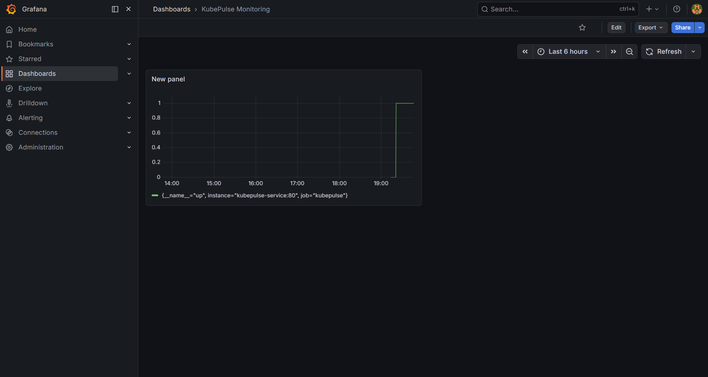
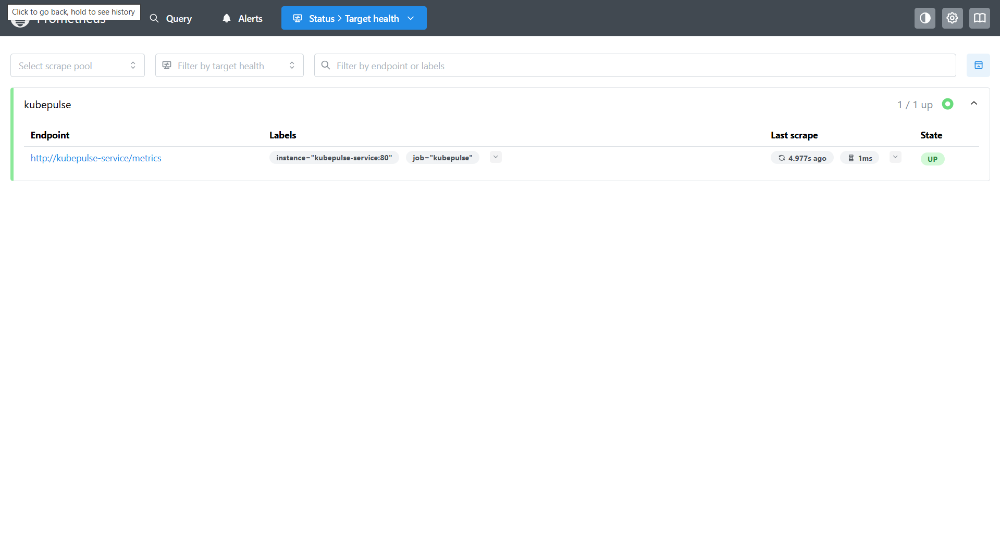
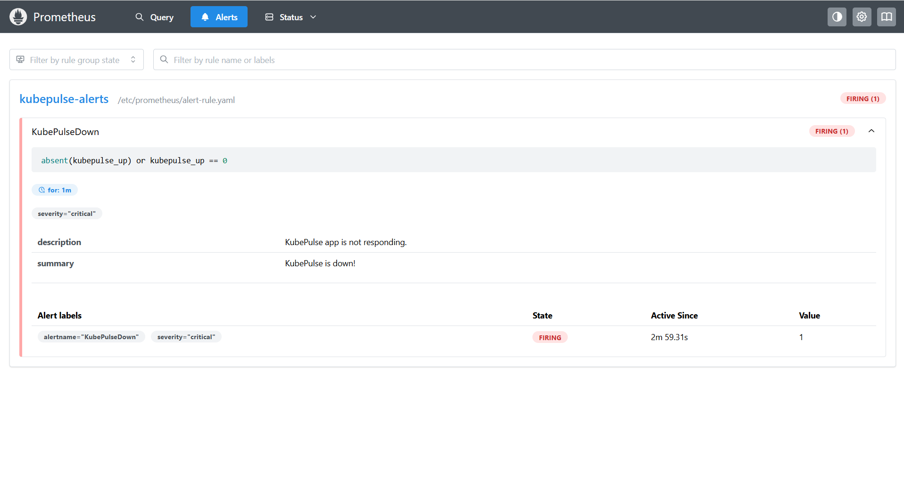

#  KubePulse: Kubernetes Monitoring & Alerting System


 

##  Overview

**KubePulse** is a production-style **Kubernetes monitoring system** that demonstrates how modern DevOps teams track application health, visualize metrics, and detect failures in real time.

This project simulates a real-world **SRE (Site Reliability Engineering)** workflow using industry-standard tools.

---

##  Key Features

*  Containerized Node.js application deployed on Kubernetes
*  Real-time metrics collection using Prometheus
*  Interactive dashboards with Grafana
*  Alerting system for application downtime
*  Custom `/metrics` endpoint for monitoring
*  Handles edge cases using `absent()` for missing metrics

---

##  Architecture

```
Client → Kubernetes Service → Application Pods
        ↓
    Prometheus (Metrics Collection)
        ↓
    Grafana (Visualization)
        ↓
    Alert Manager (Failure Detection )
```

---

##  Tech Stack

| Tool       | Purpose                         |
| ---------- | ------------------------------- |
| Kubernetes | Container orchestration         |
| Docker     | Containerization                |
| Prometheus | Metrics collection & monitoring |
| Grafana    | Visualization & dashboards      |
| Node.js    | Sample application              |

---

##  Project Structure

```
kubepulse/
├── app/            # Node.js application + Dockerfile
├── k8s/            # Kubernetes manifests (Deployment, Service)
├── monitoring/     # Prometheus, Grafana & alert configurations
├── screenshots/    # Project demo images
└── README.md
```

---

##  Getting Started

###  Start Minikube

```
minikube start
```

---

###  Build & Load Docker Image

```
docker build -t kubepulse-app .
minikube image load kubepulse-app
```

---

###  Deploy Application

```
kubectl apply -f k8s/
```

---

###  Deploy Monitoring Stack

```
kubectl apply -f monitoring/
```

---

###  Access Services

```
minikube service kubepulse-service
minikube service prometheus
minikube service grafana
```

---

##  Screenshots

### 🔹 Grafana Dashboard



### 🔹 Prometheus Targets



### 🔹 Alert Firing



---

##  Alerting Logic

Prometheus triggers alerts using:

```
absent(kubepulse_up) OR kubepulse_up == 0
```

###  Explanation:

* `kubepulse_up == 0` → App is running but unhealthy
* `absent(kubepulse_up)` → App stopped / no metrics

 Ensures **reliable failure detection**

---

##  Key Learnings

* Kubernetes deployments and service networking
* Prometheus configuration and scraping
* Grafana dashboard creation
* Handling missing metrics using `absent()`
* Real-world monitoring and alerting strategies

---


## 👨‍💻 Author

**Ashwin Poojary**

---

